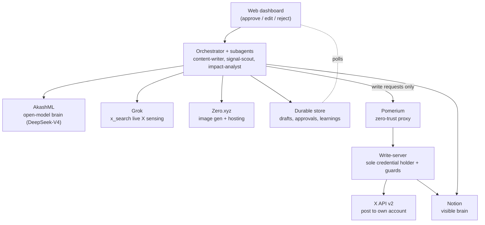
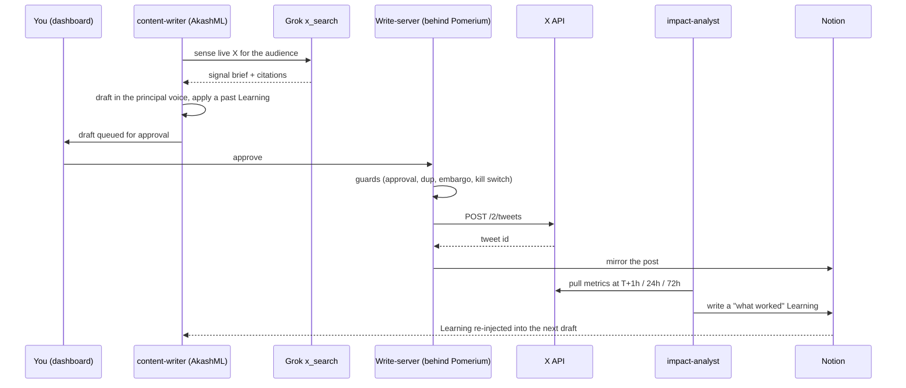
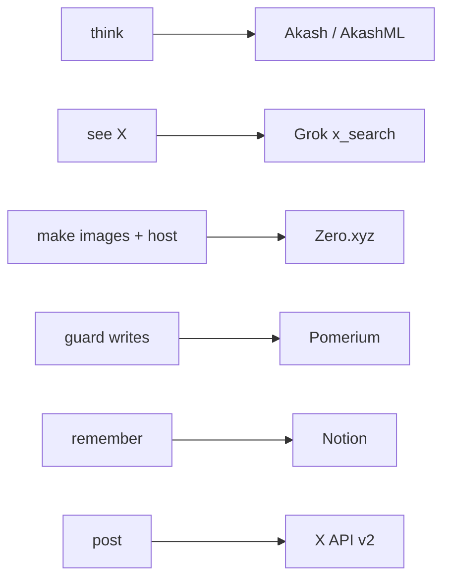

# ZeroCMO

An AI-native CMO. It reads X, decides what is signal vs noise, drafts posts in
your voice, posts on approval, measures what worked, and learns from it - so it
needs you less every week.

Built for the Loop Engineering Hackathon as a set of self-directing agent loops:
plan -> act -> observe -> self-correct.

Typefully and Hypefury schedule your tweets. ZeroCMO is the operator: every
action (draft, approval, edit, post, metric, score change) produces a Learning
that is re-injected into the next run. Open loop is lossy. This one measures its
own output and adjusts toward the goal.

## Architecture

Claude-free brain by design: the orchestrator and agents run on AkashML open
models. Grok senses X, the X API posts, Notion is the visible memory, Pomerium
guards every write, and a web dashboard is the human surface.



## The closed loop

The differentiator is the loop, not the calendar. Each run writes a Learning to
memory; the next content run re-injects it, so drafts compound.



## Sponsor bounties, wired into the core path

Each sponsor carries real architectural weight, not a bolt-on.

| Bounty | What it is | How ZeroCMO uses it |
| --- | --- | --- |
| Akash (AkashML) | Decentralized AI inference (OpenAI-compatible) | The agent brain. The orchestrator and every subagent run their tool-calling loop on `deepseek-ai/DeepSeek-V4-Flash` via AkashML. No Claude, no OpenAI on the reasoning path. |
| Zero.xyz | Agent tool-access layer (pay-per-call, one wallet) | Image generation for posts and free static hosting (the agent even publishes pages). Discovered and paid per call through the Zero CLI. |
| Pomerium | Zero-trust, identity-aware proxy | The write guard. The credential-holding write-server binds loopback; the only external path is the Pomerium route, which enforces per-request policy and can deny a tool by name at the network layer. |
| Grok (xAI) | X-native search + reasoning | Live sensing. `x_search` reads X in real time for the signal brief and the signal-scout scoring, avoiding per-read X API cost. |
| Notion | Databases + API | The visible brain. Signal scores, learnings and posts are mirrored to Notion so the principal can inspect and edit what the agent believes. |
| X API v2 | Post + own metrics | The hands. Own-account posting via OAuth 1.0a and metric reads for the Impact loop. |



## Design rules

- Guardrails are enforced in code (the write-server), not in prompts. A prompt
  rule is advisory; the write-server refuses to post without approval, over the
  daily cap, on a duplicate, on an embargoed topic, or when the kill switch is
  set.
- Single write path. `tools/x` and `tools/notion` are internal to the
  write-server and are never exposed to the model, so there is exactly one way
  to post and it is gated.
- The store is the source of truth; Notion is a display mirror.
- Signal score is per-goal and computed live by Grok, not hardcoded.

## Run it

Requires Node 18+ and pnpm. Credentials go in `config/.env` (copy
`config/.env.example`); nothing secret is committed.

```
pnpm install
cp config/.env.example config/.env    # fill in the keys
pnpm keys:check                        # verify AkashML, Grok, Notion, X

pnpm exec tsx scripts/seed.ts          # demo data, works offline
pnpm signal:scout "your audience"      # real Grok-scored signal accounts
pnpm exec tsx scripts/notion-setup.ts  # create the Notion databases
pnpm exec tsx scripts/notion-sync.ts   # populate the visible brain

WRITE_SERVER_HOST=0.0.0.0 bash scripts/dev.sh   # write-server + runner + dashboard
```

Then open the dashboard at `http://localhost:4000`, click "Run content loop",
and approve a draft to post live.

## Repo layout

```
shared/            types, JSON store, config, telemetry, Notion sync
tools/             akashml, grok, x, notion, zero clients
mcp-write-server/  the single, guarded write path
runner/            orchestrator (agent loops), scheduler, entrypoints
web/               buildless dashboard (activity feed, approve, signal board)
config/            persistent rules, schedule, autonomy, embargo
agents/            orchestrator + subagent prompts
skills/tone/       versioned tone skill
pomerium/          Pomerium Zero write-guard config
deploy/            Akash SDL + Dockerfile
scripts/           keys wizard, seed, signal scout, smoke tests
```
